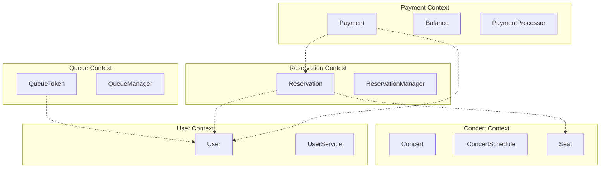
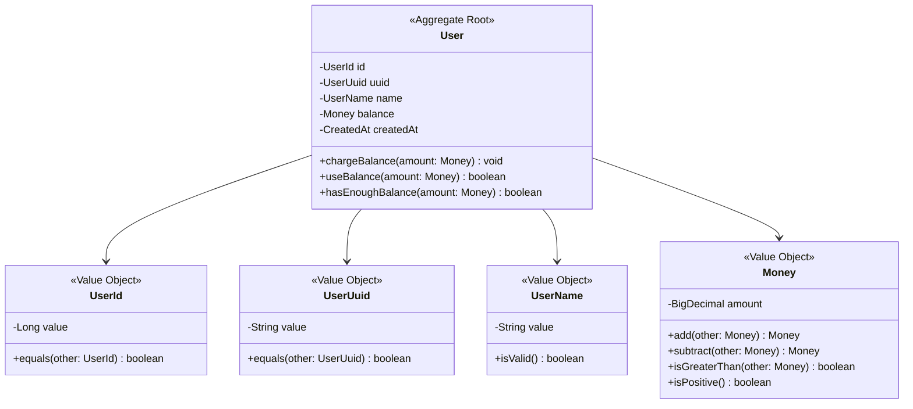
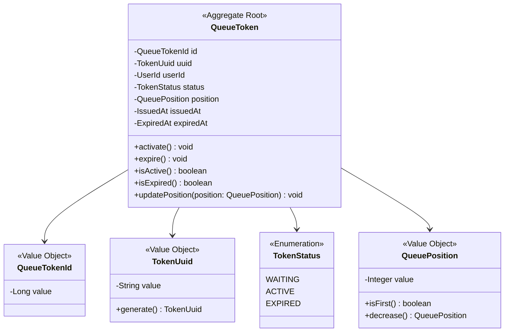
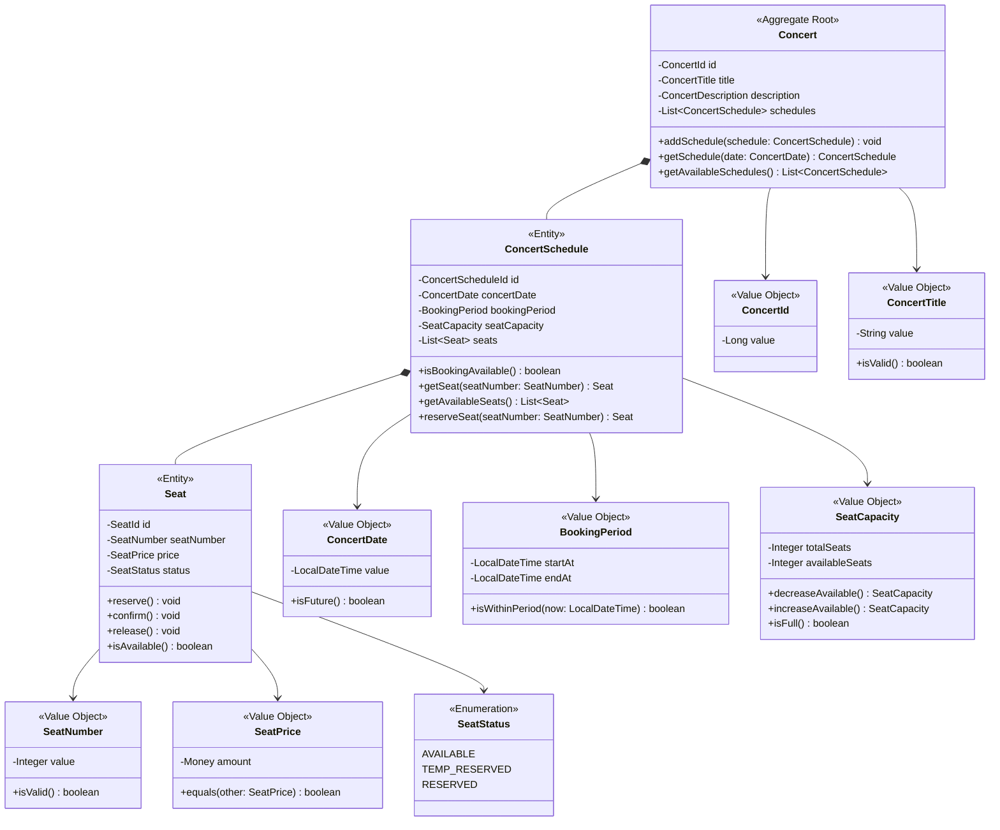
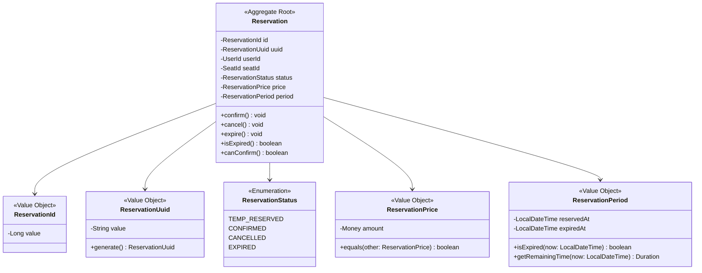
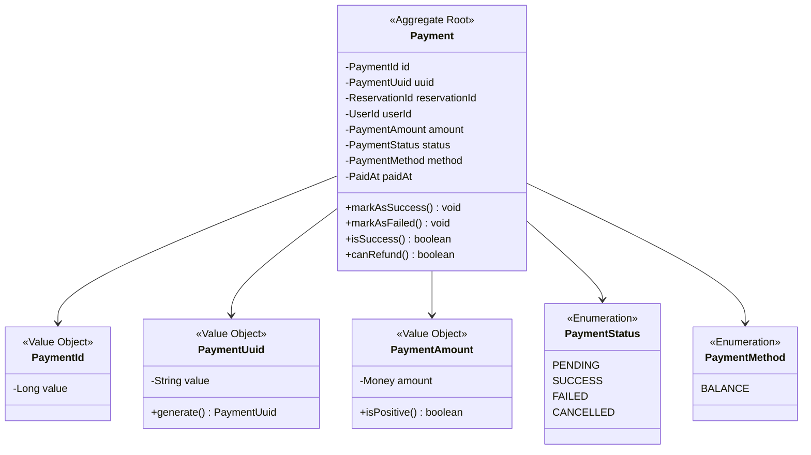
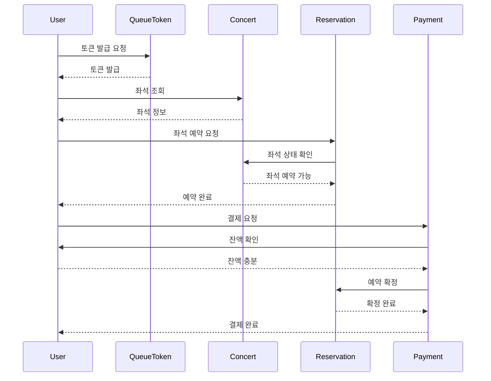

# 콘서트 예약 서비스 도메인 모델 설계

## 1. 도메인 개요

### 1.1 도메인 정의
콘서트 예약 서비스는 사용자가 대기열을 통해 콘서트 좌석을 예약하고 결제하는 서비스입니다.

### 1.2 핵심 도메인 개념
- **대기열(Queue)**: 동시 접속 제한을 위한 순서 관리 시스템
- **콘서트(Concert)**: 예약 대상이 되는 공연
- **좌석(Seat)**: 예약 가능한 개별 좌석
- **예약(Reservation)**: 좌석에 대한 임시/확정 배정
- **결제(Payment)**: 예약에 대한 금전적 거래
- **잔액(Balance)**: 사용자의 충전 가능한 결제 수단

## 2. 바운디드 컨텍스트 (Bounded Context)



## 3. 애그리거트 설계

### 3.1 User 애그리거트


### 3.2 QueueToken 애그리거트


### 3.3 Concert 애그리거트


### 3.4 Reservation 애그리거트


### 3.5 Payment 애그리거트


## 4. 도메인 서비스

### 4.1 QueueService
```java
public class QueueService {
    /**
     * 대기열 토큰 발급
     * 사용자당 하나의 활성 토큰만 허용
     */
    public QueueToken issueToken(UserId userId);
    
    /**
     * 대기열 순서 관리
     * FIFO 방식으로 순서 결정
     */
    public void updateQueuePositions();
    
    /**
     * 활성 토큰 관리
     * 최대 활성 사용자 수 제한
     */
    public void activateNextUsers(int maxActiveUsers);
    
    /**
     * 토큰 만료 처리
     */
    public void expireToken(TokenUuid tokenUuid);
}
```

### 4.2 ReservationService
```java
public class ReservationService {
    /**
     * 좌석 예약 처리
     * 동시성 제어를 통한 안전한 예약
     */
    public Reservation reserveSeat(UserId userId, SeatId seatId);
    
    /**
     * 예약 확정
     * 결제 완료 시 호출
     */
    public void confirmReservation(ReservationId reservationId);
    
    /**
     * 예약 만료 처리
     * 스케줄러를 통한 자동 처리
     */
    public void expireReservations();
}
```

### 4.3 PaymentService
```java
public class PaymentService {
    /**
     * 결제 처리
     * 잔액 검증 및 차감, 예약 확정 처리
     */
    public Payment processPayment(ReservationId reservationId, UserId userId);
    
    /**
     * 결제 검증
     * 잔액 충분성, 예약 유효성 검증
     */
    public boolean validatePayment(UserId userId, Money amount);
}
```

## 5. 리포지토리 인터페이스

### 5.1 애그리거트별 리포지토리
```java
public interface UserRepository {
    User findById(UserId id);
    User findByUuid(UserUuid uuid);
    User save(User user);
    User findByIdWithLock(UserId id);
}

public interface QueueTokenRepository {
    QueueToken findByUuid(TokenUuid uuid);
    QueueToken findByUserId(UserId userId);
    List<QueueToken> findActiveTokens();
    QueueToken save(QueueToken token);
}

public interface ConcertRepository {
    Concert findById(ConcertId id);
    List<Concert> findAll();
    Concert save(Concert concert);
}

public interface ReservationRepository {
    Reservation findById(ReservationId id);
    Reservation findByUuid(ReservationUuid uuid);
    List<Reservation> findExpiredReservations();
    Reservation save(Reservation reservation);
}

public interface PaymentRepository {
    Payment findById(PaymentId id);
    Payment findByReservationId(ReservationId reservationId);
    Payment save(Payment payment);
}
```

## 6. 도메인 이벤트

### 6.1 이벤트 정의
```java
public class ReservationCreatedEvent extends DomainEvent {
    private final ReservationId reservationId;
    private final UserId userId;
    private final SeatId seatId;
    private final LocalDateTime expiredAt;
}

public class PaymentCompletedEvent extends DomainEvent {
    private final PaymentId paymentId;
    private final ReservationId reservationId;
    private final UserId userId;
    private final Money amount;
}

public class ReservationExpiredEvent extends DomainEvent {
    private final ReservationId reservationId;
    private final SeatId seatId;
}

public class QueueTokenActivatedEvent extends DomainEvent {
    private final TokenUuid tokenUuid;
    private final UserId userId;
}
```

### 6.2 이벤트 핸들러
```java
@EventHandler
public class ReservationEventHandler {
    /**
     * 예약 생성 시 만료 스케줄 등록
     */
    public void handle(ReservationCreatedEvent event);
    
    /**
     * 예약 만료 시 좌석 해제
     */
    public void handle(ReservationExpiredEvent event);
}

@EventHandler
public class PaymentEventHandler {
    /**
     * 결제 완료 시 토큰 만료 처리
     */
    public void handle(PaymentCompletedEvent event);
}
```

## 7. 도메인 규칙

### 7.1 비즈니스 규칙
```java
public class BusinessRules {
    /**
     * 좌석 예약 규칙
     */
    public static final Duration RESERVATION_TIMEOUT = Duration.ofMinutes(5);
    public static final int MAX_SEATS_PER_SCHEDULE = 50;
    public static final int MIN_SEAT_NUMBER = 1;
    
    /**
     * 대기열 규칙
     */
    public static final int MAX_ACTIVE_USERS = 100;
    public static final Duration TOKEN_ACTIVE_DURATION = Duration.ofMinutes(30);
    
    /**
     * 결제 규칙
     */
    public static final Money MIN_CHARGE_AMOUNT = Money.of(1000);
    public static final Money MAX_CHARGE_AMOUNT = Money.of(1000000);
}
```

### 7.2 도메인 제약사항
```java
public class DomainConstraints {
    /**
     * 사용자 제약사항
     */
    public static void validateUserBalance(Money balance) {
        if (balance.isNegative()) {
            throw new IllegalArgumentException("잔액은 음수일 수 없습니다.");
        }
    }
    
    /**
     * 좌석 제약사항
     */
    public static void validateSeatNumber(SeatNumber seatNumber) {
        if (seatNumber.getValue() < 1 || seatNumber.getValue() > 50) {
            throw new IllegalArgumentException("좌석 번호는 1-50 사이여야 합니다.");
        }
    }
    
    /**
     * 예약 제약사항
     */
    public static void validateReservationPeriod(ReservationPeriod period) {
        if (period.isExpired(LocalDateTime.now())) {
            throw new IllegalStateException("만료된 예약입니다.");
        }
    }
}
```

## 8. 애그리거트 간 협력

### 8.1 예약 프로세스


## 9. 도메인 모델 검증

### 9.1 도메인 모델 완성도 체크리스트
- [ ] **애그리거트 경계**: 비즈니스 규칙과 데이터 일관성을 기준으로 명확히 구분
- [ ] **값 객체**: 도메인 개념을 표현하는 불변 객체로 정의
- [ ] **엔티티**: 식별자와 생명주기를 가진 객체로 정의
- [ ] **도메인 서비스**: 단일 애그리거트로 표현하기 어려운 비즈니스 로직
- [ ] **리포지토리**: 애그리거트 단위의 저장소 추상화
- [ ] **도메인 이벤트**: 비즈니스 중요 사건의 표현

### 9.2 설계 품질 검증
- [ ] **단일 책임**: 각 애그리거트는 하나의 책임만 가짐
- [ ] **캡슐화**: 내부 상태 변경은 애그리거트 메서드를 통해서만 가능
- [ ] **일관성**: 애그리거트 내부 불변식 유지
- [ ] **독립성**: 애그리거트 간 직접 참조 최소화
- [ ] **표현력**: 도메인 전문가와 개발자 간 공통 언어 사용