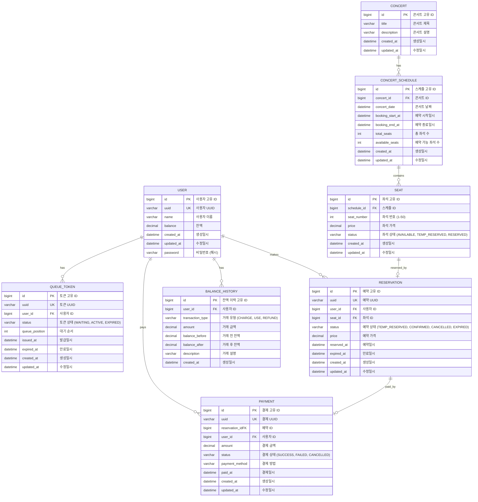

# 콘서트 예약 서비스 ERD

## ERD 다이어그램



## 테이블 상세 설명

### 1. USER (사용자)
사용자의 기본 정보와 잔액을 관리하는 테이블
- `uuid`: 외부 노출용 사용자 식별자
- `balance`: 현재 잔액 (결제에 사용)

### 2. QUEUE_TOKEN (대기열 토큰)
대기열 시스템을 위한 토큰 정보 관리
- `status`: WAITING(대기중), ACTIVE(활성), EXPIRED(만료)
- `queue_position`: 현재 대기 순서
- `expired_at`: 토큰 만료 시간

### 3. CONCERT (콘서트)
콘서트의 기본 정보를 관리하는 마스터 테이블

### 4. CONCERT_SCHEDULE (콘서트 스케줄)
특정 날짜의 콘서트 정보와 예약 가능 기간 관리
- `booking_start_at`, `booking_end_at`: 예약 가능 기간
- `available_seats`: 현재 예약 가능한 좌석 수 (성능 최적화용)

### 5. SEAT (좌석)
각 콘서트 스케줄별 좌석 정보 관리
- `seat_number`: 1~50번 좌석
- `status`: AVAILABLE(예약가능), TEMP_RESERVED(임시예약), RESERVED(예약완료)

### 6. RESERVATION (예약)
좌석 예약 정보 관리
- `status`: TEMP_RESERVED(임시예약), CONFIRMED(확정), CANCELLED(취소), EXPIRED(만료)
- `expired_at`: 임시 예약 만료 시간 (5분)

### 7. PAYMENT (결제)
결제 정보 및 결제 내역 관리
- `status`: SUCCESS(성공), FAILED(실패), CANCELLED(취소)
- `payment_method`: 결제 방법 (잔액 결제)

### 8. BALANCE_HISTORY (잔액 이력)
사용자의 잔액 변동 이력 관리 (충전, 사용, 환불)
- `transaction_type`: CHARGE(충전), USE(사용), REFUND(환불)
- `balance_before`, `balance_after`: 거래 전후 잔액

## 인덱스 전략

### 주요 인덱스
```sql
-- 성능 최적화를 위한 주요 인덱스
CREATE INDEX idx_user_uuid ON USER(uuid);
CREATE INDEX idx_queue_token_uuid ON QUEUE_TOKEN(uuid);
CREATE INDEX idx_queue_token_status ON QUEUE_TOKEN(status, queue_position);
CREATE INDEX idx_seat_schedule_status ON SEAT(schedule_id, status);
CREATE INDEX idx_reservation_user_status ON RESERVATION(user_id, status);
CREATE INDEX idx_reservation_expired_at ON RESERVATION(expired_at);
CREATE INDEX idx_concert_schedule_date ON CONCERT_SCHEDULE(concert_date);
```

## 제약 조건

### 비즈니스 제약 조건
- 한 스케줄당 좌석은 1~50번으로 고정
- 한 좌석당 하나의 유효한 예약만 존재
- 임시 예약은 5분 후 자동 만료
- 결제 완료 시에만 좌석 소유권 확정
- 사용자당 하나의 활성 토큰만 존재