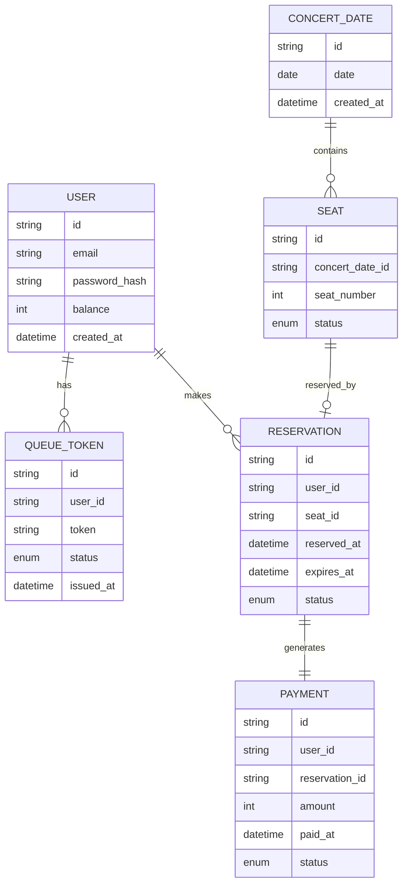

# 📌 ERD - 콘서트 예약 서비스

## Mermaid ERD

```mermaid
erDiagram

    USER ||--o{ QUEUE_TOKEN : has
    USER ||--o{ RESERVATION : makes
    RESERVATION ||--|| PAYMENT : generates
    CONCERT_DATE ||--o{ SEAT : contains
    SEAT ||--o| RESERVATION : reserved_by

    USER {
        string id
        string email
        string password_hash
        int balance
        datetime created_at
    }

    QUEUE_TOKEN {
        string id
        string user_id
        string token
        enum status
        datetime issued_at
    }

    CONCERT_DATE {
        string id
        date date
        datetime created_at
    }

    SEAT {
        string id
        string concert_date_id
        int seat_number
        enum status
    }

    RESERVATION {
        string id
        string user_id
        string seat_id
        datetime reserved_at
        datetime expires_at
        enum status
    }

    PAYMENT {
        string id
        string user_id
        string reservation_id
        int amount
        datetime paid_at
        enum status
    }
```