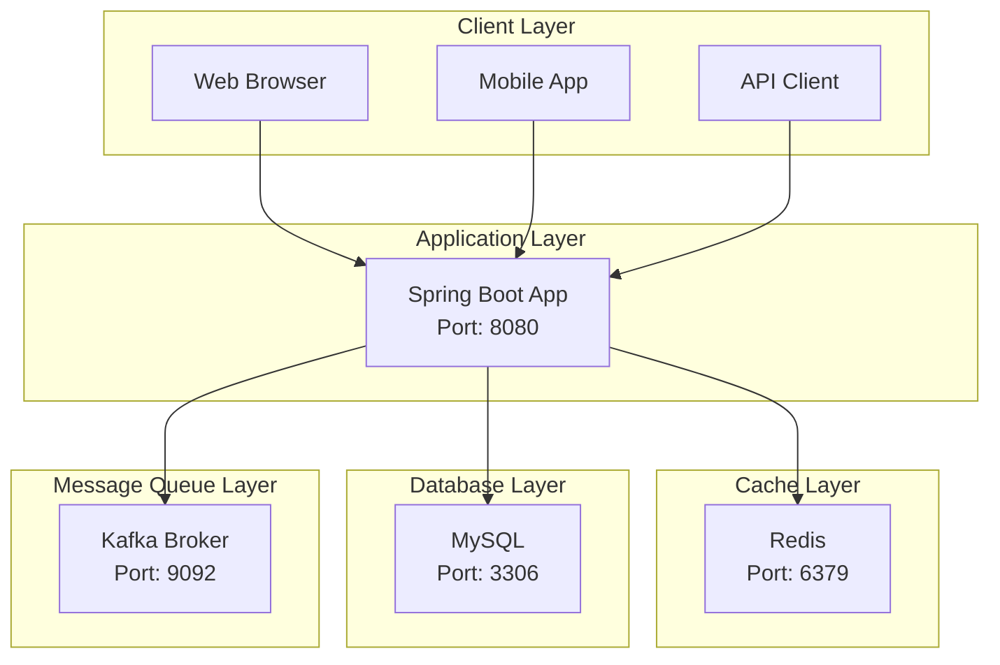

# 콘서트 예약 서비스 인프라 구성도

## 전체 인프라 구성도

## 인프라 구성 요소 상세 설명

### 1. 클라이언트 계층 (Client Layer)
**목적**: 다양한 클라이언트 환경에서 서비스 접근

- **Web Browser**: 웹 기반 사용자 인터페이스
- **Mobile App**: 모바일 애플리케이션
- **API Client**: 외부 시스템 연동을 위한 API 클라이언트

**기술 스택**:
- API: REST API, HTTP/HTTPS

### 2. 애플리케이션 계층 (Application Layer)
**목적**: 비즈니스 로직 처리 및 API 제공

**Spring Boot Application**:
- **포트**: 8080

**주요 기능**:
- REST API 제공
- 비즈니스 로직 처리
- 인증/인가 처리 (대기열 토큰 기반)
- 데이터베이스 연동
- 캐시 연동
- 메시지 큐 연동

### 3. 캐시 계층 (Cache Layer)
**목적**: 성능 향상 및 데이터베이스 부하 감소

**Redis**:
- **포트**: 6379

**캐시 전략**:
- **대기열 정보**: Redis Sorted Set으로 순서 관리
- **좌석 정보**: Redis Hash로 실시간 상태 관리
- **사용자 세션**: Redis String (TTL 30분)
- **콘서트 정보**: Redis Hash (TTL 1시간)
- **임시 예약**: Redis String (TTL 5분)

### 4. 데이터베이스 계층 (Database Layer)
**목적**: 영구 데이터 저장 및 트랜잭션 처리

**MySQL**:
- **포트**: 3306

### 5. 메시지 큐 계층 (Message Queue Layer)
**목적**: 비동기 처리 및 이벤트 기반 아키텍처 (5주차 이후)

**Apache Kafka**:

**주요 토픽**:
- `reservation-events`: 예약 관련 이벤트
- `payment-events`: 결제 관련 이벤트
- `queue-events`: 대기열 관련 이벤트

## 네트워크 구성

### 포트 할당
- **Spring Boot**: 8080
- **MySQL**: 3306
- **Redis**: 6379

### 통신 프로토콜
- **클라이언트 ↔ 애플리케이션**: HTTP/HTTPS (REST API)
- **애플리케이션 ↔ MySQL**: TCP (JDBC)
- **애플리케이션 ↔ Redis**: TCP (Redis Protocol)
- **애플리케이션 ↔ Kafka**: TCP (Kafka Protocol)

## 개발 환경 설정

### 환경별 설정
- **Local**: 단일 인스턴스, 개발 편의성 중심
- **Development**: 통합 테스트 환경
- **Production**: 성능 및 안정성 최적화

## 확장성 고려사항

### 수평 확장 (추후 계획)
- **애플리케이션**: Docker Swarm 또는 Kubernetes 사용
- **데이터베이스**: Read Replica 추가
- **캐시**: Redis Cluster 구성
- **메시지 큐**: Kafka 브로커 추가

### 성능 최적화
- **연결 풀**: 적절한 크기 설정
- **캐시**: 히트율 모니터링 및 최적화
- **인덱스**: 쿼리 성능 최적화
- **JVM 튜닝**: GC 최적화

## 장애 대응

### 헬스체크
- **애플리케이션**: Spring Boot Actuator
- **데이터베이스**: 연결 상태 체크
- **캐시**: Redis 응답 시간 체크
- **메시지 큐**: 브로커 상태 체크

### 백업 전략
- **데이터베이스**: 매일 자동 백업
- **캐시**: 메모리 덤프 (중요 데이터만)
- **설정 파일**: Git 버전 관리