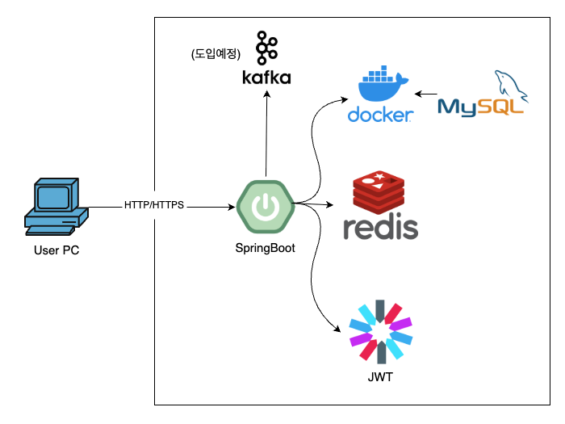

# 인프라 구성도 설명

다음은 콘서트 예약 서비스의 전체 인프라 구성도입니다.  

---

## 구성요소 설명

| 구성 요소 | 설명 |
|-----------|------|
| **User PC** | 사용자가 브라우저 또는 클라이언트 앱을 통해 API에 접근합니다. |
| **Spring Boot** | 메인 백엔드 애플리케이션으로, 사용자 요청 처리, 예약 로직, 결제 처리 등 모든 핵심 비즈니스 로직을 담당합니다. |
| **JWT** | 로그인한 사용자에게 발급되는 토큰으로, 이후 모든 요청의 인증에 사용됩니다. Spring Security + JWT 필터로 검증됩니다. |
| **Redis** | 대기열 토큰 관리, 임시 좌석 예약 TTL 저장소, 추후 랭킹 및 캐시 전략에도 활용 예정입니다. |
| **MySQL** | 모든 핵심 데이터(User, Seat, Reservation, Payment 등)를 저장하는 RDB입니다. docker-compose로 관리됩니다. |
| **Docker** | MySQL은 도커 컨테이너로 실행되며, 프로젝트 루트에 `docker-compose.yml`을 통해 로컬 개발 환경을 구성합니다. |
| **Kafka** *(도입 예정)* | 예약/결제 이벤트를 비동기 처리하기 위한 메시지 브로커입니다. 6~10주차에서 분산 이벤트 시스템 구성 시 사용할 예정입니다. |

---

## 주요 특징

- **단일 Spring Boot 앱** 기반 구조
- **JWT 기반 인증 / Redis 기반 TTL 관리 / MySQL 영속 저장**
- **Kafka는 도입 예정이지만 아키텍처에 포함되어 미리 설계됨**
