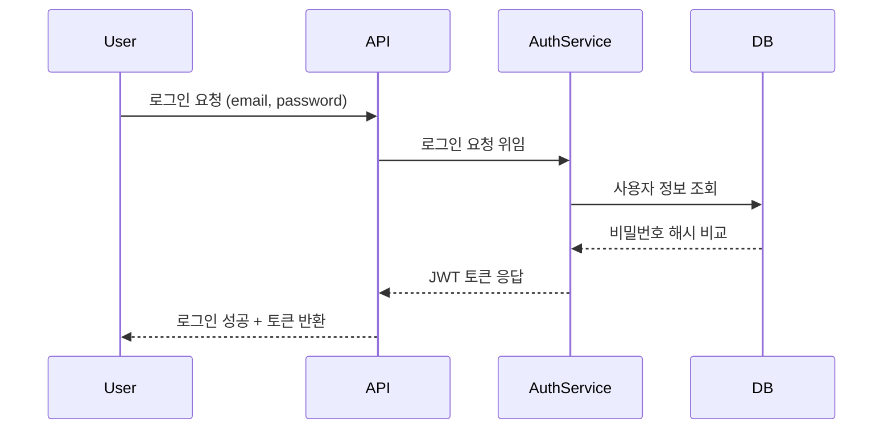
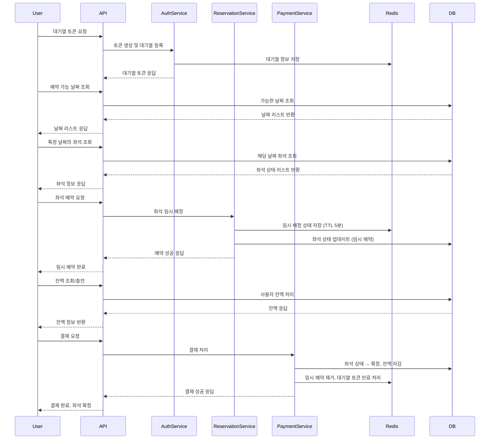
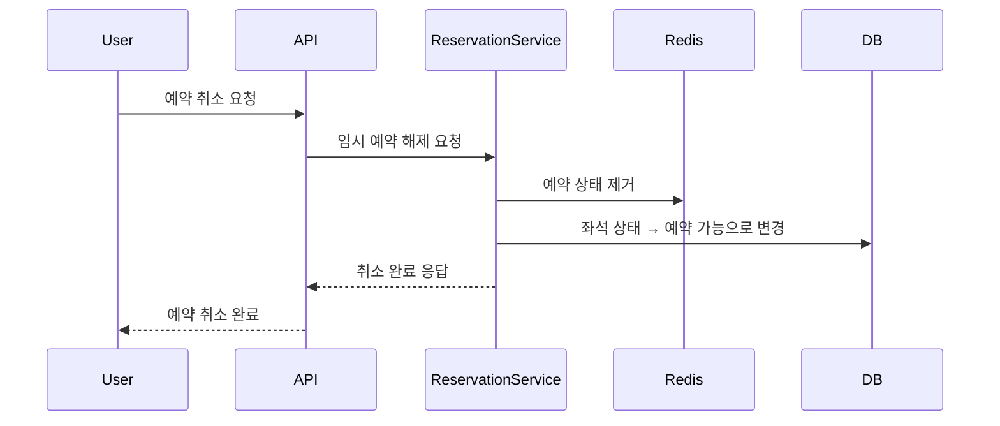
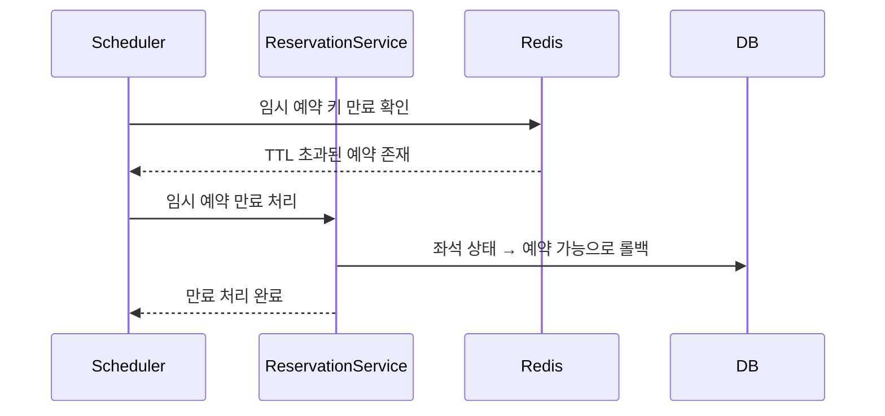

# 📌 시퀀스 다이어그램: 콘서트 예약 서비스

## 0. 로그인 흐름

```mermaid
sequenceDiagram
    participant User
    participant API
    participant AuthService
    participant DB

    User->>API: 로그인 요청 (email, password)
    API->>AuthService: 로그인 요청 위임
    AuthService->>DB: 사용자 정보 조회
    DB-->>AuthService: 비밀번호 해시 비교
    AuthService-->>API: JWT 토큰 응답
    API-->>User: 로그인 성공 + 토큰 반환
```

---

## 1. 좌석 예약 흐름

```mermaid
sequenceDiagram
    participant User
    participant API
    participant AuthService
    participant ReservationService
    participant PaymentService
    participant Redis
    participant DB

    User->>API: 대기열 토큰 요청
    API->>AuthService: 토큰 생성 및 대기열 등록
    AuthService->>Redis: 대기열 정보 저장
    AuthService-->>API: 대기열 토큰 응답

    User->>API: 예약 가능 날짜 조회
    API->>DB: 가능한 날짜 조회
    DB-->>API: 날짜 리스트 반환
    API-->>User: 날짜 리스트 응답

    User->>API: 특정 날짜의 좌석 조회
    API->>DB: 해당 날짜 좌석 조회
    DB-->>API: 좌석 상태 리스트 반환
    API-->>User: 좌석 정보 응답

    User->>API: 좌석 예약 요청
    API->>ReservationService: 좌석 임시 배정
    ReservationService->>Redis: 임시 배정 상태 저장 (TTL 5분)
    ReservationService->>DB: 좌석 상태 업데이트 (임시 예약)
    ReservationService-->>API: 예약 성공 응답
    API-->>User: 임시 예약 완료

    User->>API: 잔액 조회/충전
    API->>DB: 사용자 잔액 처리
    DB-->>API: 잔액 응답
    API-->>User: 잔액 정보 반환

    User->>API: 결제 요청
    API->>PaymentService: 결제 처리
    PaymentService->>DB: 좌석 상태 → 확정, 잔액 차감
    PaymentService->>Redis: 임시 예약 제거, 대기열 토큰 만료 처리
    PaymentService-->>API: 결제 성공 응답
    API-->>User: 결제 완료, 좌석 확정
```

---

## 2. 예약 취소 흐름

```mermaid
sequenceDiagram
    participant User
    participant API
    participant ReservationService
    participant Redis
    participant DB

    User->>API: 예약 취소 요청
    API->>ReservationService: 임시 예약 해제 요청
    ReservationService->>Redis: 예약 상태 제거
    ReservationService->>DB: 좌석 상태 → 예약 가능으로 변경
    ReservationService-->>API: 취소 완료 응답
    API-->>User: 예약 취소 완료
```

---

## 3. 결제 실패 또는 임시 예약 만료 흐름

```mermaid
sequenceDiagram
    participant Scheduler
    participant ReservationService
    participant Redis
    participant DB

    Scheduler->>Redis: 임시 예약 키 만료 확인
    Redis-->>Scheduler: TTL 초과된 예약 존재

    Scheduler->>ReservationService: 임시 예약 만료 처리
    ReservationService->>DB: 좌석 상태 → 예약 가능으로 롤백
    ReservationService-->>Scheduler: 만료 처리 완료
```