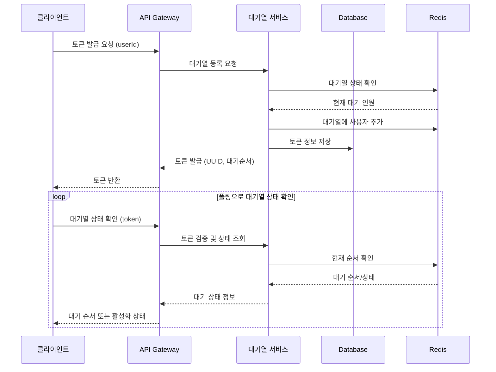
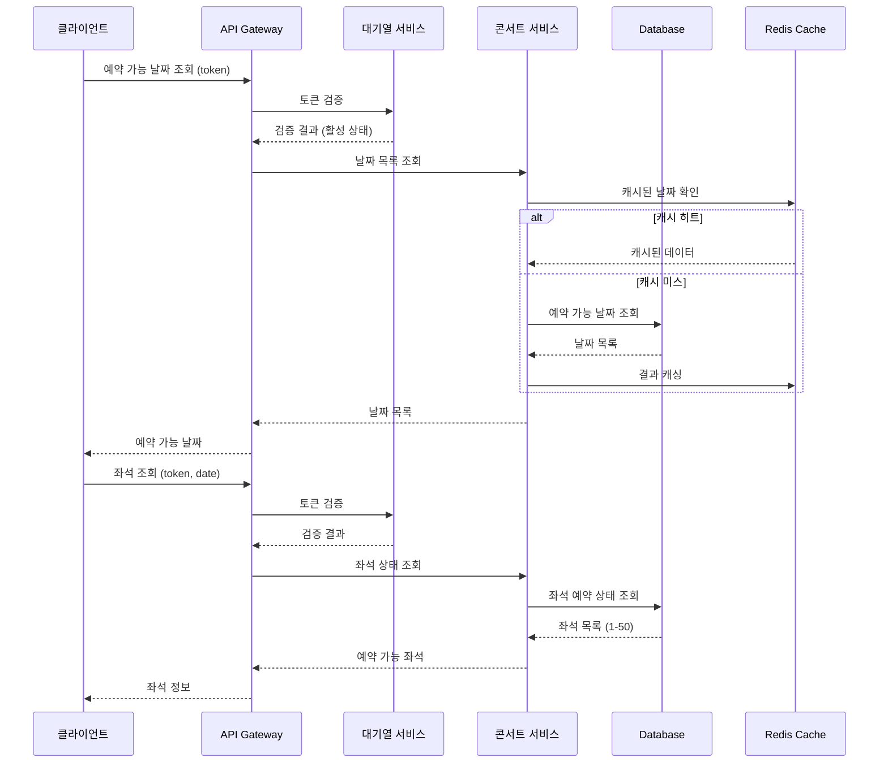
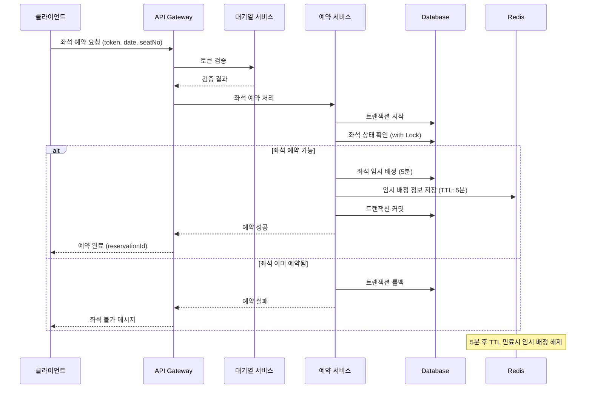
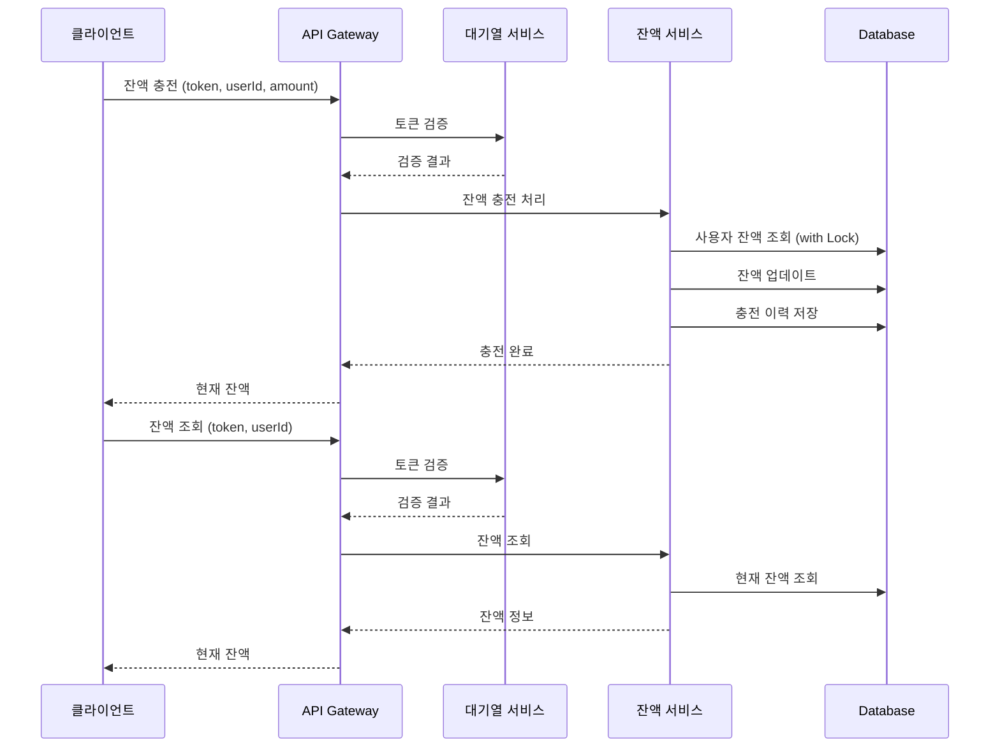
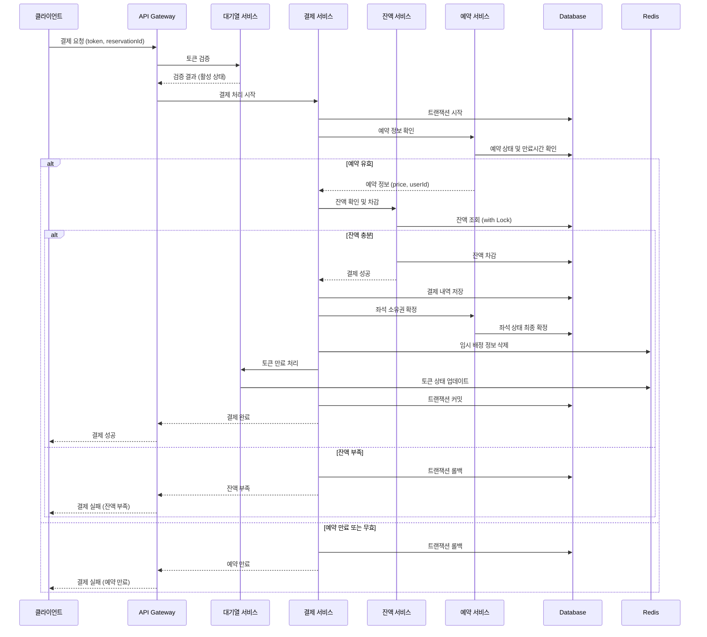
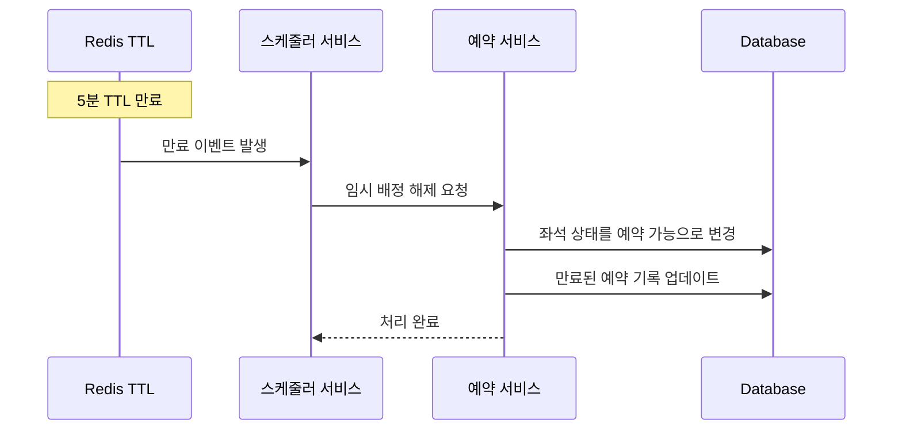

# 콘서트 예약 서비스 시퀀스 다이어그램

## 1. 대기열 토큰 발급 및 대기열 확인

```mermaid
sequenceDiagram
    participant Client as 클라이언트
    participant API as API Gateway
    participant QueueService as 대기열 서비스
    participant DB as Database
    participant Redis as Redis

    Client->>API: 토큰 발급 요청 (userId)
    API->>QueueService: 대기열 등록 요청
    QueueService->>Redis: 대기열 상태 확인
    Redis-->>QueueService: 현재 대기 인원
    QueueService->>Redis: 대기열에 사용자 추가
    QueueService->>DB: 토큰 정보 저장
    QueueService-->>API: 토큰 발급 (UUID, 대기순서)
    API-->>Client: 토큰 반환

    loop 폴링으로 대기열 상태 확인
        Client->>API: 대기열 상태 확인 (token)
        API->>QueueService: 토큰 검증 및 상태 조회
        QueueService->>Redis: 현재 순서 확인
        Redis-->>QueueService: 대기 순서/상태
        QueueService-->>API: 대기 상태 정보
        API-->>Client: 대기 순서 또는 활성화 상태
    end
```

## 2. 예약 가능 날짜 및 좌석 조회

```mermaid
sequenceDiagram
    participant Client as 클라이언트
    participant API as API Gateway
    participant QueueService as 대기열 서비스
    participant ConcertService as 콘서트 서비스
    participant DB as Database
    participant Cache as Redis Cache

    Client->>API: 예약 가능 날짜 조회 (token)
    API->>QueueService: 토큰 검증
    QueueService-->>API: 검증 결과 (활성 상태)
    API->>ConcertService: 날짜 목록 조회
    ConcertService->>Cache: 캐시된 날짜 확인
    alt 캐시 히트
        Cache-->>ConcertService: 캐시된 데이터
    else 캐시 미스
        ConcertService->>DB: 예약 가능 날짜 조회
        DB-->>ConcertService: 날짜 목록
        ConcertService->>Cache: 결과 캐싱
    end
    ConcertService-->>API: 날짜 목록
    API-->>Client: 예약 가능 날짜

    Client->>API: 좌석 조회 (token, date)
    API->>QueueService: 토큰 검증
    QueueService-->>API: 검증 결과
    API->>ConcertService: 좌석 상태 조회
    ConcertService->>DB: 좌석 예약 상태 조회
    DB-->>ConcertService: 좌석 목록 (1-50)
    ConcertService-->>API: 예약 가능 좌석
    API-->>Client: 좌석 정보
```

## 3. 좌석 예약 요청

```mermaid
sequenceDiagram
    participant Client as 클라이언트
    participant API as API Gateway
    participant QueueService as 대기열 서비스
    participant ReservationService as 예약 서비스
    participant DB as Database
    participant Redis as Redis

    Client->>API: 좌석 예약 요청 (token, date, seatNo)
    API->>QueueService: 토큰 검증
    QueueService-->>API: 검증 결과

    API->>ReservationService: 좌석 예약 처리
    ReservationService->>DB: 트랜잭션 시작
    ReservationService->>DB: 좌석 상태 확인 (with Lock)
    
    alt 좌석 예약 가능
        ReservationService->>DB: 좌석 임시 배정 (5분)
        ReservationService->>Redis: 임시 배정 정보 저장 (TTL: 5분)
        ReservationService->>DB: 트랜잭션 커밋
        ReservationService-->>API: 예약 성공
        API-->>Client: 예약 완료 (reservationId)
    else 좌석 이미 예약됨
        ReservationService->>DB: 트랜잭션 롤백
        ReservationService-->>API: 예약 실패
        API-->>Client: 좌석 불가 메시지
    end

    Note over Redis: 5분 후 TTL 만료시 임시 배정 해제
```

## 4. 잔액 충전 및 조회

```mermaid
sequenceDiagram
    participant Client as 클라이언트
    participant API as API Gateway
    participant QueueService as 대기열 서비스
    participant BalanceService as 잔액 서비스
    participant DB as Database

    Client->>API: 잔액 충전 (token, userId, amount)
    API->>QueueService: 토큰 검증
    QueueService-->>API: 검증 결과
    API->>BalanceService: 잔액 충전 처리
    BalanceService->>DB: 사용자 잔액 조회 (with Lock)
    BalanceService->>DB: 잔액 업데이트
    BalanceService->>DB: 충전 이력 저장
    BalanceService-->>API: 충전 완료
    API-->>Client: 현재 잔액

    Client->>API: 잔액 조회 (token, userId)
    API->>QueueService: 토큰 검증
    QueueService-->>API: 검증 결과
    API->>BalanceService: 잔액 조회
    BalanceService->>DB: 현재 잔액 조회
    BalanceService-->>API: 잔액 정보
    API-->>Client: 현재 잔액
```

## 5. 결제 처리

```mermaid
sequenceDiagram
    participant Client as 클라이언트
    participant API as API Gateway
    participant QueueService as 대기열 서비스
    participant PaymentService as 결제 서비스
    participant BalanceService as 잔액 서비스
    participant ReservationService as 예약 서비스
    participant DB as Database
    participant Redis as Redis

    Client->>API: 결제 요청 (token, reservationId)
    API->>QueueService: 토큰 검증
    QueueService-->>API: 검증 결과 (활성 상태)
    
    API->>PaymentService: 결제 처리 시작
    PaymentService->>DB: 트랜잭션 시작
    
    PaymentService->>ReservationService: 예약 정보 확인
    ReservationService->>DB: 예약 상태 및 만료시간 확인
    
    alt 예약 유효
        ReservationService-->>PaymentService: 예약 정보 (price, userId)
        PaymentService->>BalanceService: 잔액 확인 및 차감
        BalanceService->>DB: 잔액 조회 (with Lock)
        
        alt 잔액 충분
            BalanceService->>DB: 잔액 차감
            BalanceService-->>PaymentService: 결제 성공
            PaymentService->>DB: 결제 내역 저장
            PaymentService->>ReservationService: 좌석 소유권 확정
            ReservationService->>DB: 좌석 상태 최종 확정
            PaymentService->>Redis: 임시 배정 정보 삭제
            PaymentService->>QueueService: 토큰 만료 처리
            QueueService->>Redis: 토큰 상태 업데이트
            PaymentService->>DB: 트랜잭션 커밋
            PaymentService-->>API: 결제 완료
            API-->>Client: 결제 성공
        else 잔액 부족
            PaymentService->>DB: 트랜잭션 롤백
            PaymentService-->>API: 잔액 부족
            API-->>Client: 결제 실패 (잔액 부족)
        end
    else 예약 만료 또는 무효
        PaymentService->>DB: 트랜잭션 롤백
        PaymentService-->>API: 예약 만료
        API-->>Client: 결제 실패 (예약 만료)
    end
```

## 6. 임시 배정 만료 처리

```mermaid
sequenceDiagram
    participant Redis as Redis TTL
    participant SchedulerService as 스케줄러 서비스
    participant ReservationService as 예약 서비스
    participant DB as Database

    Note over Redis: 5분 TTL 만료
    Redis->>SchedulerService: 만료 이벤트 발생
    SchedulerService->>ReservationService: 임시 배정 해제 요청
    ReservationService->>DB: 좌석 상태를 예약 가능으로 변경
    ReservationService->>DB: 만료된 예약 기록 업데이트
    ReservationService-->>SchedulerService: 처리 완료
```