# 콘서트 예약 서비스 상태 다이어그램

## 1. 대기열 토큰 상태 다이어그램

## 2. 좌석 상태 다이어그램

## 3. 예약 상태 다이어그램

## 4. 결제 상태 다이어그램

```mermaid
stateDiagram-v2
    [*] --> PROCESSING : 결제 요청
    
    PROCESSING --> SUCCESS : 잔액 충분 & 처리 성공
    PROCESSING --> FAILED : 잔액 부족
    PROCESSING --> FAILED : 예약 만료
    PROCESSING --> FAILED : 시스템 오류
    
    SUCCESS --> SUCCESS : 최종 상태
    FAILED --> CANCELLED : 관리자 취소
    FAILED --> FAILED : 기본 상태
    CANCELLED --> CANCELLED : 최종 상태
    
    note right of PROCESSING
        - 결제 처리 중
        - 트랜잭션 진행
        - 원자성 보장
    end note
    
    note right of SUCCESS
        - 결제 완료
        - 좌석 소유권 확정
        - 토큰 만료 처리
    end note
    
    note right of FAILED
        - 결제 실패
        - 예약 상태 롤백
        - 좌석 해제
    end note
```

## 5. 사용자 잔액 트랜잭션 상태 다이어그램

## 6. 전체 예약 프로세스 상태 다이어그램

## 상태 전이 규칙

### 대기열 토큰
- **WAITING → ACTIVE**: 시스템에서 자동으로 순서에 따라 활성화
- **ACTIVE → EXPIRED**: 결제 완료 또는 30분 시간 만료
- **WAITING → EXPIRED**: 최대 대기 시간 초과

### 좌석 상태
- **AVAILABLE → TEMP_RESERVED**: 동시성 제어를 통한 단일 사용자만 성공
- **TEMP_RESERVED → AVAILABLE**: 5분 TTL 만료 또는 사용자 취소
- **TEMP_RESERVED → RESERVED**: 결제 완료 시에만 가능

### 예약 상태
- **임시 예약 → 확정**: 결제 완료 시에만 가능
- **임시 예약 → 만료**: 5분 후 자동 처리
- **확정 예약**: 변경 불가능한 최종 상태

### 결제 상태
- **처리 중 → 성공**: 모든 검증 통과 시
- **처리 중 → 실패**: 잔액 부족, 예약 만료, 시스템 오류 시
- **실패 → 취소**: 관리자 개입 시에만 가능